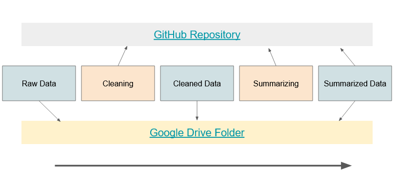

# HAFTRAP-summary
All outlying analysis (primarily summary statistics) for the indoor-outdoor monitoring for the HAFTRAP study from November 1, 2024.

## Data
The data files for this analysis - both raw and cleaned - are large and therefore not committed to this repository (see gitignore).

This [Google Drive folder](https://drive.google.com/drive/folders/1PnhpKO4doi4ZTjJZnZ5-LmHT_GkFLuK_?usp=sharing) contains the data folders. Download a copy locally, and place the subfolders `data_raw` and `data_cleaned` in the root directory of your clone of this repository. (If it says that you don't have permission to access the folder, copy paste the link directly into your browser: https://drive.google.com/drive/folders/1PnhpKO4doi4ZTjJZnZ5-LmHT_GkFLuK_?usp=sharing)

## Running
The files in `data_cleaned` are the output of running `data_raw` through the scripts in `cleaning/`. If you would like to re-generate the cleaned data, run the scripts in `cleaning/`, otherwise feel free to start with the cleaned data (`data_summarized` is likewise the output of running `data_cleaned` through the scripts in `summarizing/`).

## Detailed walk-through
The above information should be enough for you to get started running the files and figuring out how things work. However, here's a more detailed explanation for how the analysis is structured and how this repository fits into that:

### Overview

Figure 1 outlines that the pipeline has five components that work in simple chronology - raw data is run through cleaning scripts to produce cleaned data, which is then run through summarizing scripts to produce summarized data. Each component is a folder in the repository. However, as noted above, the data files are stored separately in a [Google Drive folder](https://drive.google.com/drive/folders/1PnhpKO4doi4ZTjJZnZ5-LmHT_GkFLuK_?usp=sharing) and must be downloaded and placed appropriately in the root folder of your local clone of this repository.

Figures and other analysis are done in a separate folder `other_scripts`, that I will talk about at the end. You are ready to go when your clone of this repository has the following folders: `.img/`, `cleaning/`, `data_cleaned/`, `data_raw/`, `data_summarized/`, `other_scripts/`, and `summarizing/`.

Let's quickly walk through each component of the pipeline:

### Raw Data
Found in the [data folder linked above](https://drive.google.com/drive/folders/1PnhpKO4doi4ZTjJZnZ5-LmHT_GkFLuK_?usp=sharing) as `data_raw`. I preserved the original structure as much as possible. There are three deployment groups - Olin, Tufts, and SCOPE (a.k.a. "four homes") each with their own folder and vastly different data format. 

Each contains a field notes file with contextual information about the deployments. Note that these folders were created from hours of manually copying, downloading, and consolidating folders from many different data sources, and can be considered the central repository for the air monitoring data related to HAFTRAP.

### Cleaning
Each R Markdown cleaning script in this folder (`cleaning`) follows the format `project_sensor_cleaning.Rmd` (e.g. `Olin_modpm_cleaning.Rmd`). Each script does four important things for the corresponding data:

1. Combines all the data from different files for that sensor type
2. Uses the filenames, field notes from raw data to insert contextual info
3. Filters out invalid raw data values E.g.- status flags == 0, pump flow > 250
4. Calculates indoor-outdoor (I/O) ratios

For additional transparency, I have documented each of the cleaning steps taken in each type of data in [this spreadsheet](https://docs.google.com/spreadsheets/d/1z2BgGIi9X4b3cQWm8y5aC_sqlYSlHHQOuacqmdssyLY/edit?usp=sharing).

### Cleaned data
This is the output of the cleaning scripts above. I have pre-computed them for you and saved the data in the [same data folder](https://drive.google.com/drive/folders/1PnhpKO4doi4ZTjJZnZ5-LmHT_GkFLuK_?usp=sharing) in `data_cleaned` as `.RData` files named `cleaned_project_sensor` (e.g.- `cleaned_Olin_modpm`). 

All the files, regardless of project or sensor type, have the same standard fields:

* Date - timestamp, in Eastern Time
* Participant ID - anonymized HAFTRAP ID (when multiple in household, only one included)
* Environment - “indoor”, “outdoor”, “ratio”
* Case - “off” (no filter) or “on” (with filter)
* [data variable(s)] e.g.- `pm_1`, `uv_bc1` etc. depending on the sensor

### Summarizing
These scripts calculate summary statistics from the cleaned data files, consolidating the data across projects by the pollutant type. They are named `pollutantgroup_summarizing.Rmd` (e.g. `pm_summarizing.Rmd`) and nearly identical to each other since the cleaned data, as you saw above, is standardized. 

These scripts calculate summary statistics of mean, select percentiles, and standard deviation, as well as the percentage reduction from the "sham" (off) purifier case to the "HEPA" (on) case. The statistics are calculated for each participant and overall.

### Summarized Data
The (almost) final section of this pipeline, this is the only one that is stored both in the [Google Drive](https://drive.google.com/drive/folders/1PnhpKO4doi4ZTjJZnZ5-LmHT_GkFLuK_?usp=sharing) (for easy download of data) and this GitHub repository (since the summary files are relatively small). The CSV files are named `summary_pollutantgroup_redu/raw` (e.g.- `summary_pm_raw`).

* `raw` files have the absolute values, such as the median indoor PM1 for participant 41181 with the sham purifier.
* `redu` files, however, have percentage reductions from sham to HEPA (e.g.- the percentage reduction in median indoor PM1 for participant 41181 is 84%)

Note that a negative percentage reduction indicates an *increase* in that value from sham to HEPA.

### Other Scripts
These scripts don't fit neatly into the pipeline, and they use a mix of cleaned and summarized data for more exploratory analysis. All of the figures you may have seen from this analysis are generated by the following scripts:

1. `boxplot_generation` - creates boxplots from summary data
2. `diurnal_openair` - creates diurnals from cleaned data
3. `format_tables` - generates pretty tables of summary statistics

The only other file, `csv_cleaned_data`, generates CSV files combining cleaned data across pollutants. The consolidated CSV files will be generated to the `data_cleaned` folder under the `clean_csv` subfolder. Note that this data is also uploaded to the [Google Drive folder](https://drive.google.com/drive/folders/1PnhpKO4doi4ZTjJZnZ5-LmHT_GkFLuK_?usp=sharing) except for the UFP data, which is a 1 GB file which is better to generate locally instead of uploading.

## Conclusion
And there you have it! Please don't hesitate to reach out with any questions, requests, or comments.
